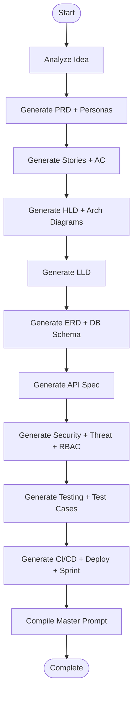

# SpecForge — System Architecture

## 1. Executive Summary

SpecForge is a monorepo SaaS application with a **Next.js 15** frontend and a **FastAPI** backend. The core value is an **LLM-orchestrated generation pipeline** (LangGraph) that transforms a user's product idea into 10 persisted artifact documents, each containing multiple structured sections.

```
┌─────────────────────────────────────────────────────────────────────────┐
│                           CLIENT (Browser)                              │
│  Next.js 15 · Zustand · TanStack Query · SSE EventSource               │
└───────────────────────────────┬─────────────────────────────────────────┘
                                │ HTTPS / REST / SSE
┌───────────────────────────────▼─────────────────────────────────────────┐
│                        API LAYER (FastAPI)                              │
│  Auth · Projects CRUD · Artifacts CRUD · Generation · Export             │
└───────────────────────────────┬─────────────────────────────────────────┘
                                │
        ┌───────────────────────┼───────────────────────┐
        ▼                       ▼                       ▼
┌───────────────┐     ┌─────────────────┐     ┌─────────────────┐
│  PostgreSQL   │     │   LangGraph     │     │   OpenAI API    │
│  SQLAlchemy   │     │   Workflow      │     │   GPT-4o        │
└───────────────┘     └─────────────────┘     └─────────────────┘
```

---

## 2. Architectural Principles

| Principle | Decision |
|-----------|----------|
| Separation of concerns | Frontend = presentation; Backend = business logic + AI |
| Single source of truth | PostgreSQL stores all projects and artifacts |
| Streaming UX | SSE pushes generation events to the dashboard timeline |
| Idempotent generation | Each LangGraph node upserts its artifact type |
| Type safety | Shared enums/types in `packages/shared` |
| BFF optional | Frontend calls FastAPI directly; CORS + JWT |
| Dark-first UI | CSS variables, shadcn theming, minimal chrome |

---

## 3. Monorepo Structure

```
SpecForge/
├── apps/
│   ├── web/                 # Next.js 15 App Router
│   └── api/                 # FastAPI + LangGraph
├── packages/
│   └── shared/              # ArtifactType enum, API contracts
├── docker/
│   ├── docker-compose.yml
│   ├── Dockerfile.api
│   └── Dockerfile.web
├── scripts/
│   ├── dev.sh
│   └── seed.sh
└── docs/
```

**Package manager:** `pnpm` workspaces for JS/TS; `uv` for Python.

---

## 4. Domain Model

### 4.1 Entities

```
User ──< Project ──< Artifact
              │
              └──< GenerationEvent
```

### 4.2 `users`

| Column | Type | Notes |
|--------|------|-------|
| id | UUID | PK |
| email | VARCHAR(255) | unique, indexed |
| password_hash | VARCHAR(255) | bcrypt |
| name | VARCHAR(255) | display name |
| avatar_url | VARCHAR(512) | nullable |
| plan | ENUM | free, pro, enterprise |
| created_at | TIMESTAMPTZ | |
| updated_at | TIMESTAMPTZ | |

### 4.3 `projects`

| Column | Type | Notes |
|--------|------|-------|
| id | UUID | PK |
| user_id | UUID | FK → users |
| title | VARCHAR(255) | auto-generated or user-set |
| idea | TEXT | raw product idea input |
| status | ENUM | draft, generating, completed, failed |
| generation_progress | INT | 0–100 |
| metadata | JSONB | tags, target stack hints, etc. |
| created_at | TIMESTAMPTZ | |
| updated_at | TIMESTAMPTZ | |

### 4.4 `artifacts`

| Column | Type | Notes |
|--------|------|-------|
| id | UUID | PK |
| project_id | UUID | FK → projects |
| type | ENUM | see §4.5 |
| title | VARCHAR(255) | |
| content | TEXT | Markdown body |
| structured_content | JSONB | sections, diagrams, tables |
| content_format | ENUM | markdown, mermaid, openapi, json |
| version | INT | increments on edit |
| is_generated | BOOLEAN | AI vs user-edited |
| created_at | TIMESTAMPTZ | |
| updated_at | TIMESTAMPTZ | |

**Unique constraint:** `(project_id, type)` — one artifact slot per type per project.

### 4.5 Artifact Types & Section Mapping

```python
class ArtifactType(str, Enum):
    PRD = "PRD"
    STORIES = "STORIES"
    HLD = "HLD"
    LLD = "LLD"
    ERD = "ERD"
    API_SPEC = "API_SPEC"
    SECURITY = "SECURITY"
    TESTING = "TESTING"
    DEPLOYMENT = "DEPLOYMENT"
    MASTER_PROMPT = "MASTER_PROMPT"
```

Each artifact's `structured_content` follows a schema:

```json
{
  "sections": [
    { "id": "personas", "title": "User Personas", "content": "...", "format": "markdown" },
    { "id": "architecture_diagram", "title": "Architecture", "content": "graph TD...", "format": "mermaid" }
  ],
  "metadata": { "model": "gpt-4o", "tokens_used": 4200 }
}
```

### 4.6 `generation_events`

| Column | Type | Notes |
|--------|------|-------|
| id | UUID | PK |
| project_id | UUID | FK |
| artifact_type | ENUM | nullable for global events |
| event_type | ENUM | started, progress, completed, error |
| message | TEXT | human-readable timeline entry |
| payload | JSONB | node output summary |
| created_at | TIMESTAMPTZ | |

---

## 5. LangGraph Generation Pipeline

### 5.1 State Schema

```python
class GenerationState(TypedDict):
    project_id: str
    idea: str
    title: str
    context: dict[str, str]          # accumulated prior artifact summaries
    current_artifact: ArtifactType | None
    errors: list[str]
```

### 5.2 Workflow Graph



### 5.3 Node Responsibilities

| Node | Output Artifact | Key Sections |
|------|-----------------|--------------|
| `analyze_idea` | — | Extracts title, domain, entities; updates project |
| `generate_prd` | PRD | Executive summary, goals, personas, requirements |
| `generate_stories` | STORIES | Epics, user stories, acceptance criteria |
| `generate_hld` | HLD | Components, integrations, Mermaid architecture |
| `generate_lld` | LLD | Modules, classes, sequences, data flows |
| `generate_erd` | ERD | Tables, relationships, Mermaid ER diagram |
| `generate_api_spec` | API_SPEC | OpenAPI-style endpoints, auth, errors |
| `generate_security` | SECURITY | Audit, STRIDE threat model, RBAC matrix |
| `generate_testing` | TESTING | Strategy, pyramid, test cases table |
| `generate_deployment` | DEPLOYMENT | CI/CD YAML outline, infra, sprint plan |
| `generate_master_prompt` | MASTER_PROMPT | Consolidated AI coding prompt |

### 5.4 Context Passing

Each node receives **summaries** of prior artifacts (not full content) to stay within token limits:

```python
context = {
    "prd_summary": "...",
    "stories_summary": "...",
    # ...
}
```

### 5.5 Streaming Integration

Each node:
1. Emits `GenerationEvent(started)` via SSE
2. Calls OpenAI with structured output (JSON schema)
3. Upserts `artifacts` row
4. Emits `GenerationEvent(completed)` with preview snippet
5. Updates `projects.generation_progress`

On failure: emit `error`, set `projects.status = failed`, allow retry from last completed node.

---

## 6. API Design

Base URL: `/api/v1`

### 6.1 Authentication

| Method | Endpoint | Description |
|--------|----------|-------------|
| POST | `/auth/register` | Create account |
| POST | `/auth/login` | Returns JWT access + refresh |
| POST | `/auth/refresh` | Refresh token |
| GET | `/auth/me` | Current user |

**Auth:** Bearer JWT in `Authorization` header.

### 6.2 Projects

| Method | Endpoint | Description |
|--------|----------|-------------|
| GET | `/projects` | List user's projects |
| POST | `/projects` | Create project with `idea` |
| GET | `/projects/{id}` | Project detail + artifact summary |
| PATCH | `/projects/{id}` | Update title, metadata |
| DELETE | `/projects/{id}` | Soft or hard delete |

### 6.3 Generation

| Method | Endpoint | Description |
|--------|----------|-------------|
| POST | `/projects/{id}/generate` | Start LangGraph pipeline (async) |
| GET | `/projects/{id}/generate/stream` | SSE event stream |
| POST | `/projects/{id}/generate/retry` | Retry from failed node |

### 6.4 Artifacts

| Method | Endpoint | Description |
|--------|----------|-------------|
| GET | `/projects/{id}/artifacts` | List all artifacts |
| GET | `/projects/{id}/artifacts/{type}` | Single artifact |
| PATCH | `/projects/{id}/artifacts/{type}` | User edit (Monaco) |
| GET | `/projects/{id}/export` | ZIP of all artifacts |

### 6.5 Activity

| Method | Endpoint | Description |
|--------|----------|-------------|
| GET | `/projects/{id}/events` | Generation timeline (paginated) |

### 6.6 SSE Event Format

```
event: generation
data: {"event_type":"progress","artifact_type":"HLD","message":"Generating architecture diagrams...","progress":35}
```

---

## 7. Frontend Architecture

### 7.1 Route Groups

| Route | Purpose |
|-------|---------|
| `/` | Landing page (marketing) |
| `/pricing` | Pricing tiers |
| `/login`, `/signup` | Auth |
| `/dashboard` | Project list, recent activity |
| `/projects/[id]` | Workspace — artifact tabs, editor, timeline |
| `/settings` | User preferences |

### 7.2 State Management

| Concern | Tool |
|---------|------|
| Server data | TanStack Query (projects, artifacts) |
| UI state | Zustand (sidebar, active tab, command palette) |
| Generation stream | Custom hook + EventSource |
| Auth token | httpOnly cookie or secure localStorage |

### 7.3 Key UI Modules

```
LandingPage
├── HeroSection          # Animated gradients, floating cards
├── DemoSection          # Interactive artifact preview
├── FeaturesGrid
├── PricingTable
└── CTASection

DashboardLayout
├── Sidebar              # Project explorer, nav
├── CommandPalette       # ⌘K search & actions
├── ActivityPanel        # Recent events
└── MainContent

ProjectWorkspace
├── ArtifactNav          # 10 artifact type tabs
├── ContentViewer        # Markdown + Mermaid render
├── MonacoEditor         # Edit mode
├── DiagramPanel         # React Flow for HLD (optional enhancement)
├── GenerationTimeline   # Real-time SSE feed
└── ExportToolbar        # MD, PDF, ZIP
```

### 7.4 Design System

- **Colors:** Near-black background (`#09090b`), subtle borders (`#27272a`), accent gradient (violet → blue)
- **Typography:** Geist Sans / Inter, tight tracking on headings
- **Motion:** Framer Motion page transitions; Aceternity/Magic UI for hero effects
- **Components:** shadcn/ui base; custom `ArtifactCard`, `TimelineItem`, `GradientOrb`

---

## 8. Security Architecture

| Layer | Measure |
|-------|---------|
| Transport | HTTPS only in production |
| Auth | JWT (short-lived access + refresh rotation) |
| Passwords | bcrypt, min 12 rounds |
| API | User-scoped queries — no cross-tenant access |
| Rate limiting | Per-user generation limits by plan |
| Secrets | `.env` locally; vault in production |
| CORS | Whitelist frontend origin |
| Input | Sanitize idea text; max length 10k chars |
| SSE | Auth token via query param or cookie |

---

## 9. Deployment Architecture

### 9.1 Local Development

```
docker-compose.yml
├── postgres:16
├── api (hot reload)
└── web (hot reload)
```

### 9.2 Production (recommended)

| Service | Platform |
|---------|----------|
| Frontend | Vercel |
| API | Railway / Fly.io / AWS ECS |
| Database | Neon / Supabase / RDS PostgreSQL |
| Secrets | Platform env vars |

### 9.3 CI/CD (GitHub Actions)

- Lint + typecheck on PR
- Backend pytest
- Frontend build
- Docker image publish on `main`
- Alembic migrate on deploy

---

## 10. Observability

| Signal | Tool |
|--------|------|
| Logs | structlog (JSON) |
| Errors | Sentry |
| Metrics | Prometheus / platform metrics |
| Tracing | OpenTelemetry (optional phase 2) |

---

## 11. Scalability Considerations

- **Generation is async** — FastAPI `BackgroundTasks` or Celery/ARQ for production scale
- **SSE connections** — Redis pub/sub for multi-instance fan-out
- **Token costs** — Cache summaries; allow partial regeneration per artifact
- **DB** — Index `(user_id, created_at)` on projects; `(project_id, type)` on artifacts

---

## 12. Technology Decision Records

### TDR-001: LangGraph over raw chains
LangGraph provides checkpointing, conditional edges, and retry — critical for 11-step pipeline.

### TDR-002: Structured JSON in artifacts
`structured_content` JSONB enables section-level rendering (Mermaid vs Markdown) without parsing.

### TDR-003: SSE over WebSockets
One-way server→client stream is sufficient; simpler infra than WS.

### TDR-004: Monorepo
Shared `ArtifactType` enum prevents frontend/backend drift.

### TDR-005: No separate diagram storage
Mermaid embedded in artifact sections; React Flow for interactive views derived from structured data.
