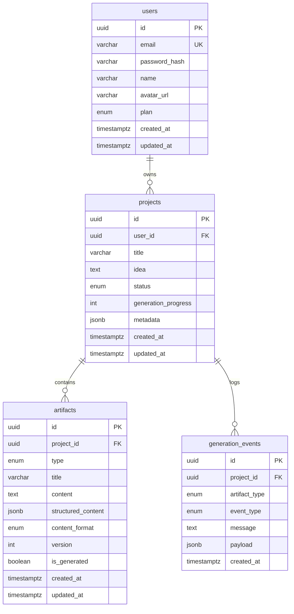

# SpecForge — Database Schema

## Entity Relationship Diagram



## Tables

### `users`

| Column | Type | Constraints |
|--------|------|-------------|
| id | UUID | PRIMARY KEY, DEFAULT uuid_generate_v4() |
| email | VARCHAR(255) | UNIQUE, NOT NULL, INDEX |
| password_hash | VARCHAR(255) | NOT NULL |
| name | VARCHAR(255) | NOT NULL |
| avatar_url | VARCHAR(512) | NULLABLE |
| plan | ENUM(free, pro, enterprise) | NOT NULL, DEFAULT free |
| created_at | TIMESTAMPTZ | DEFAULT now() |
| updated_at | TIMESTAMPTZ | DEFAULT now() |

### `projects`

| Column | Type | Constraints |
|--------|------|-------------|
| id | UUID | PRIMARY KEY |
| user_id | UUID | FK → users.id ON DELETE CASCADE, INDEX |
| title | VARCHAR(255) | NOT NULL |
| idea | TEXT | NOT NULL |
| status | ENUM(draft, generating, completed, failed) | NOT NULL, DEFAULT draft |
| generation_progress | INTEGER | NOT NULL, DEFAULT 0 (0–100) |
| metadata | JSONB | NULLABLE |
| created_at | TIMESTAMPTZ | DEFAULT now() |
| updated_at | TIMESTAMPTZ | DEFAULT now() |

### `artifacts`

| Column | Type | Constraints |
|--------|------|-------------|
| id | UUID | PRIMARY KEY |
| project_id | UUID | FK → projects.id ON DELETE CASCADE, INDEX |
| type | ENUM(PRD, STORIES, ...) | NOT NULL |
| title | VARCHAR(255) | NOT NULL |
| content | TEXT | NOT NULL, DEFAULT '' |
| structured_content | JSONB | NULLABLE |
| content_format | ENUM(markdown, mermaid, openapi, json) | DEFAULT markdown |
| version | INTEGER | NOT NULL, DEFAULT 1 |
| is_generated | BOOLEAN | NOT NULL, DEFAULT false |
| created_at | TIMESTAMPTZ | DEFAULT now() |
| updated_at | TIMESTAMPTZ | DEFAULT now() |

**Unique:** `(project_id, type)` — one artifact per type per project.

### `generation_events`

| Column | Type | Constraints |
|--------|------|-------------|
| id | UUID | PRIMARY KEY |
| project_id | UUID | FK → projects.id ON DELETE CASCADE, INDEX |
| artifact_type | ENUM(...) | NULLABLE |
| event_type | ENUM(started, progress, completed, error) | NOT NULL |
| message | TEXT | NOT NULL |
| payload | JSONB | NULLABLE |
| created_at | TIMESTAMPTZ | DEFAULT now() |

## Indexes

```sql
CREATE INDEX ix_users_email ON users(email);
CREATE INDEX ix_projects_user_id ON projects(user_id);
CREATE INDEX ix_artifacts_project_id ON artifacts(project_id);
CREATE INDEX ix_generation_events_project_id ON generation_events(project_id);
CREATE UNIQUE INDEX uq_artifact_project_type ON artifacts(project_id, type);
```

## Migrations

```bash
cd apps/api
alembic upgrade head      # Apply migrations
alembic revision --autogenerate -m "description"  # New migration
```

Migration file: `apps/api/alembic/versions/001_initial_schema.py`
